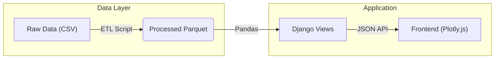

<div align="center">

# 📊 GovHack '24: Socioeconomic Insights Dashboard


<br>

**A production-ready data storytelling platform visualising the factors influencing youth education, employment, and mental health choices in Australia.**

[Features](#-key-features) •
[Quick Start](#-quick-start) •
[Tech Stack](#%EF%B8%8F-tech-stack) •
[Architecture](#-architecture)

---
</div>

## 📖 About The Project

This project transforms open government data (ABS, AIHW) into an immersive, interactive experience. It moves beyond static spreadsheets to provide a **living dashboard** where policymakers and the public can explore the correlations between income, education, crime, and mental health.

### 🎯 Key Features

*   **✨ Modern Bento Grid Interface**: A responsive, high-density layout inspired by modern design trends.
*   **🌙 Dark Mode**: Fully supported dark/light themes with accessible high-contrast modes.
*   **📊 Interactive Storytelling**: 
    *   **Consolidated Home View**: See the big picture with cross-correlated charts.
    *   **Deep Dives**: Dedicated tabs for Income, Education, Crime, and Mental Health.
    *   **Zoom & Pan**: Powered by Plotly.js for detailed data exploration.
*   **🗺️ Geospatial & Demographics**: Interactive visualisations of data distribution across Australian states.
*   **📑 Resource Centre**: 
    *   **Smart Print**: Generate clean, full-page PDF reports of the dashboard.
    *   **Downloads**: Access original research papers (PDF) and high-res charts (PNG).
*   **🏗️ Robust Data Pipeline**: Automated ETL process converting raw CSVs to optimised Parquet files.

---

## ⚡ Quick Start

Get the dashboard running in minutes.

### 🐳 Option 1: Docker (Recommended)

The easiest way to run the full stack (App + Data Processing).

```bash
# 1. Clone the repository
git clone https://github.com/lagnadlinus/open_gov_data_visualisation.git
cd open_gov_data_visualisation

# 2. Build and Run
docker-compose up --build
```

> **Access**: Open your browser to [http://localhost:8000](http://localhost:8000)

### 🐍 Option 2: Local Python

For developers wanting to modify the code.

1.  **Install Dependencies**:
    ```bash
    pip install .
    ```

2.  **Run ETL (Data Processing)**:
    ```bash
    # Transforms raw CSV data into optimised Parquet files
    python -m etl.loaddata
    ```

3.  **Run Server**:
    ```bash
    export DEBUG=True
    export SECRET_KEY=dev_secret_key
    python career_visualizer/manage.py runserver
    ```

---

## 🛠️ Tech Stack

Built with a focus on performance, scalability, and maintainability.

| Layer | Technology | Description |
| :--- | :--- | :--- |
| **Backend** |  | Robust web framework serving JSON APIs and HTML. |
| **Frontend** |   | Semantic HTML + Vanilla JS for lightweight interactivity. |
| **Viz** |  | High-performance interactive charting library. |
| **Data** |   | ETL processing and optimized columnar storage. |
| **Ops** |  | Containerized deployment environment. |

---

## 🏗 Architecture



## 🔒 Security

We take data security seriously.
*   **Secrets Management**: No hardcoded secrets; environment variables used for configuration.
*   **Data Hygiene**: automated cleanup of raw sensitive files.
*   See [SECURITY.md](SECURITY.md) for our full policy.

---

<div align="center">
    Made with ❤️ for GovHack '24
</div>
